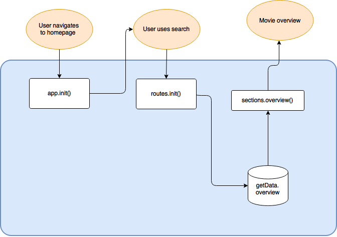

## Moodvie
Moodvie is a single page app that provides movies in two ways. When you enter the webpage you land on a searchbar, here you can enter your query and you'll get the results displayed.

The second way is based on your mood (Moodvie). You have to click the emoticon that fits your emotion and based on that emotion you get movies that relate to that genre.

[Demo](https://giuliam.github.io/wafs/opdracht6-api/#movies)

### Features
- Search by query
- Search by mood (genre)

### Wishlist
- User to decide what mood fits to genre
- Show more movies (now 20)
- 404 handling

## Object Model

## Flow Chart

### Overview

### Detail

### Filter

